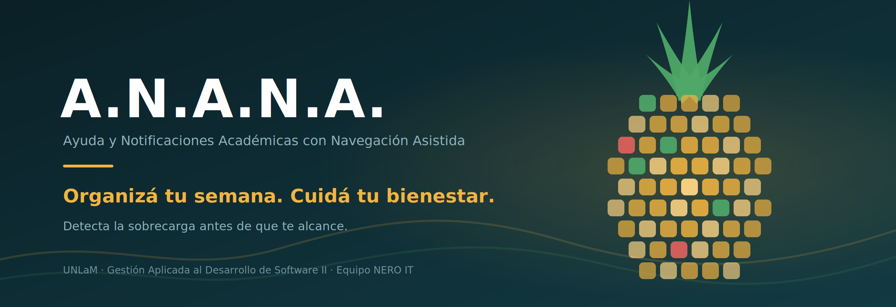

  

  
  
  
  

---

## Qué es A.N.A.N.A.

Una herramienta que centraliza las obligaciones académicas del estudiante, lo ayuda a priorizarlas y le avisa **antes** de que la carga se le vuelva un problema.

La aplicación ofrece un espacio privado donde registrar materias, entregas, eventos y el propio estado general, para obtener una vista integrada de la semana.

> **A.N.A.N.A. es una herramienta preventiva.** No realiza diagnósticos clínicos, no interpreta enfermedades y no reemplaza la asistencia de profesionales de la salud.

## El problema

Los estudiantes que combinan la cursada con trabajo u otras responsabilidades organizan sus entregas de forma dispersa e informal, y no tienen ningún registro de su propio nivel de carga que les permita anticiparse.

Del relevamiento hecho con tres estudiantes reales del segmento:

| Hallazgo | Resultado |
|---|---|
| Se olvidaron o se enteraron tarde de una entrega o parcial | 3 de 3 |
| Sienten con frecuencia más responsabilidades de las que pueden manejar | 3 de 3 |
| Prefieren una vista semanal con prioridades antes que una lista plana | 3 de 3 |
| Registran hoy en algún lado su ánimo o nivel de estrés | 0 de 3 |
| Reemplazarían su método actual por A.N.A.N.A. | 3 de 3 |

Hoy se organizan con WhatsApp, con la agenda del celular, o directamente sin ningún método.

## Funcionalidades

| | Funcionalidad | Qué resuelve |
|---|---|---|
| 📚 | **Organización de materias, entregas y eventos** | Un solo lugar donde registrar todo, en vez de buscarlo disperso en conversaciones. |
| 🗓️ | **Dashboard y checklist semanal** | La semana agrupada por prioridad, para saber qué sigue sin leer toda la lista. |
| 💬 | **Check-in de bienestar** | Un registro breve y privado de ánimo, energía y nivel de carga. |
| ⚠️ | **Detección preventiva de sobrecarga** | Cruza las entregas próximas con los check-ins y avisa antes de que se acumule. |
| 📊 | **Relevamiento de estadísticas** | Indicadores anónimos y agregados por carrera para áreas institucionales. |
| 🤝 | **Acceso a canales de ayuda** | Vías de contacto que ya ofrece la universidad. |

## Segmento

Estudiantes regulares de pregrado y grado de la UNLaM que, por trabajo, responsabilidades familiares u otros motivos personales, atraviesan ansiedad, estrés o sobrecarga, y tienen dificultades recurrentes de organización y rendimiento académico.

Sobre un universo de 43.865 estudiantes, estimamos el segmento entre 9.000 y 15.000 personas.

## Stack

El front-end, el back-end, la lógica del dashboard, el cálculo preventivo de sobrecarga y las operaciones sobre los datos son de desarrollo propio.

`Next.js` · `React` · `TypeScript` · `Server Actions` · `Supabase Auth` · `Supabase PostgreSQL`

## Documentación

| Documento | Contenido |
|---|---|
| [`docs/brief.md`](docs/brief.md) | Brief de producto. Segmento, funcionalidades, perfil de usuario, hipótesis de valor y estado de los supuestos. |
| [`docs/evidencia/tp2/`](docs/evidencia/tp2/) | Evidencia del relevamiento con usuarios reales, anonimizada. |
| [`docs/prompts.md`](docs/prompts.md) | Registro de las interacciones del equipo con herramientas de IA. |

## Equipo NERO IT

| Integrante |
|---|
| Tiago Giannotti |
| Valentín Massa |
| Alejandro Nicolás Maudet |
| Alan Eitan Mangano Rosenfeld |
| Leonel Maximiliano De Luca |

  Universidad Nacional de La Matanza · Departamento de Ingeniería e Investigaciones Tecnológicas · Gestión Aplicada al Desarrollo de Software II (3665)

